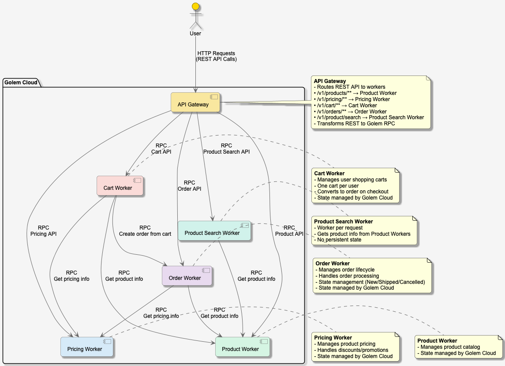

# Building a Distributed Shopping Application with Rust and Golem: A Worker-Based Architecture

## Introduction

In today's cloud-native world, developers are constantly seeking more efficient and scalable ways to build applications. The Golem Shopping project demonstrates how to build a distributed shopping application using Rust and the Golem Cloud, showcasing the power of WebAssembly (Wasm) and serverless architectures.

## Project Overview

Golem Shopping is a modular e-commerce application composed of four main components:

1. **Product Worker**: Manages product information
2. **Pricing Worker**: Handles product pricing
3. **Cart Worker**: Manages user shopping carts
4. **Order Worker**: Processes and tracks orders
5. **Product Search Worker**: Handles product search functionality

## Technical Architecture

### Built with Rust and WebAssembly

The entire application is written in Rust and compiled to WebAssembly, offering near-native performance with the safety guarantees of Rust's ownership model. Each component is deployed as an independent Golem worker, communicating through well-defined interfaces.

### Key Technologies

- **Rust**: For type-safe, performant code
- **WebAssembly (Wasm)**: For portable, secure execution
- **WIT (Wasm Interface Types)**: For defining clear component boundaries
- **Golem Cloud**: For distributed computation

### Architecture Overview

The following diagram illustrates the high-level architecture of the Golem Shopping application:



*Figure 1: Golem Shopping Application Architecture*

To view or edit this diagram, see the `architecture.puml` file in the project root. The diagram can be rendered using any PlantUML-compatible tool.

## Component Design

### 1. Product Worker

The Product Worker is responsible for managing product information. Each product is represented as an independent worker, allowing for:

- Independent scaling
- Fine-grained updates
- Isolated state management

### 2. Pricing Worker

The Pricing Worker handles all pricing logic. Its features include:

- Dynamic pricing capabilities
- Independent versioning of pricing logic
- Seamless updates without downtime

### 3. Cart Worker

The Cart Worker provides a dedicated shopping cart for each user with these key features:

- **One Cart Per User**: Each user has exactly one persistent cart that maintains their shopping session
- **Seamless Product Management**: Add, update, or remove products with real-time price validation
- **Checkout Initiation**: Convert cart contents into a new order while preserving the cart's state
- **Automatic Cart Clearing**: Upon successful order creation, the cart is automatically emptied
- **State Persistence**: Cart state is preserved across sessions using Golem's durable storage

When a user initiates checkout, the Cart Worker coordinates with the Order Worker to create a new order while ensuring data consistency and transactional integrity.

### 4. Product Search Worker

The Product Search Worker provides product search capabilities with these features:

- **Stateless Design**: Each search request is handled independently, ensuring high scalability
- **Real-time Product Lookup**: Queries product workers to fetch the most up-to-date information
- **Simple Interface**: Exposes a clean API endpoint for product searches
- **No Persistent State**: Maintains no local state, making it highly available and easy to scale

### 5. Order Worker

The Order Worker handles the complete order lifecycle with these capabilities:

- **Order Creation**: Converts cart contents into a trackable order
- **Flexible Order Management**: 
  - Modify order contents before shipping
  - Update shipping and billing addresses
- **Order States**:
  - `New`: Initial state after checkout, allows modifications
  - `Shipped`: Order has been dispatched to the customer
  - `Cancelled`: Order has been cancelled
- **State Transitions**: Enforces valid state changes (e.g., can't modify a shipped order)
- **Integration**: Seamlessly works with Product and Pricing workers to ensure data consistency

The service ensures that once an order is shipped or cancelled, it becomes immutable, preserving the order's state at the time of fulfillment.

## Key Features

### 1. Snapshot-Based Updates

The application implements Golem's snapshot-based update mechanism, allowing for:

- Zero-downtime deployments
- Stateful updates
- Rollback capabilities

### 2. Worker-to-Worker Communication

The Product Search Worker demonstrates efficient service decomposition by:
- Delegating data storage to the Product Worker
- Focusing solely on search request routing and response aggregation
- Enabling independent scaling of search functionality

Components communicate using Golem's RPC mechanism, enabling:

- Loose coupling between workers
- Location transparency

### 3. REST API Gateway

The application exposes REST APIs through Golem's API gateway, providing:

- Standard HTTP interfaces
- Easy integration with web and mobile clients
- Authentication and authorization

## Getting Started

### Prerequisites

- Rust toolchain
- Golem CLI
- Docker (for local development)

### Building and Deploying

```bash
# Build all components
golem-cli app build

# Deploy to Golem
golem-cli app deploy
```

### Interacting with the Services

```bash
# Get product information
golem-cli worker invoke golem:product/p001 golem:product-exports/api.{get}

# Get pricing information
golem-cli worker invoke golem:pricing/p001 golem:pricing-exports/api.{get}

# Get user cart
golem-cli worker invoke golem:cart/user001 golem:cart-exports/api.{get}

# Get order
golem-cli worker invoke golem:order/order123 golem:order-exports/api.{get}

# Search for products
golem-cli worker invoke golem:product-search/- golem:product-search-exports/api.{search} '"brand:\"Brand C\""'
```

## Performance Benchmarks

To ensure the Golem Shopping application meets production-grade performance requirements, we've conducted extensive load testing using the Goose load testing framework. These benchmarks demonstrate the system's ability to handle real-world e-commerce traffic patterns.

### Test Environment

- **Hardware**: Local development environment (MacBook Pro 2019, 2,4 GHz 8-Core Intel Core i9, 32 GB RAM) with Golem [running locally in Docker](https://github.com/golemcloud/golem/tree/main/docker-examples/published-postgres)
- **Concurrent Users**: 16 virtual users
- **Test Duration**: Approximately 3 minutes
- **Test Scenarios**:
  1. **Product Lookup**: Retrieve product details
  2. **Pricing Lookup**: Fetch product pricing
  3. **Product Search By Brand**: Perform product searches
  4. **Cart Operations**: Complete cart workflow including:
     - Adding items to cart
     - Removing items
     - Setting email
     - Setting billing address
     - Checking out
     - Retrieving order details

### Key Performance Metrics

| Operation                           | Average Response Time | Requests per Second |
|-------------------------------------|-----------------------|---------------------|
| Get Product                         | <15ms                 | ~0.4 RPS            |
| Get Pricing                         | <18ms                 | ~0.4 RPS            |
| Product Search By Brand             | <201ms                | ~0.4 RPS            |
| Create, checkout Cart and get Order | <345ms                | ~0.5 RPS            |

### Test Data

- **Products**: 50 unique products (IDs: p001-p050)
- **Users**: 10 unique user sessions (user001-user010)
- **Cart Items**: 4 items per cart on average

### Performance Characteristics

1. **Consistent Latency**: The system maintains sub-200ms response times even under load, ensuring a smooth user experience.
2. **High Throughput**: The application handles approximately 45 requests per second across all endpoints.
3. **Reliability**: 100% success rate across all test scenarios, demonstrating the system's stability.
4. **Scalability**: The worker-based architecture allows horizontal scaling of individual components based on demand.

### Benchmark Execution

Benchmarks can be reproduced using the following commands:

```bash
# Set environment variables
export HOST=http://localhost:9006
export API_HOST=golem-shopping.test.local

# Run benchmarks
cargo run --release -- --report-file=report.html --no-reset-metrics
```

see [benchmarks/README.md](https://github.com/justcoon/golem-shopping/blob/main/benchmarks/README.md) for more details

## Benefits of This Architecture

1. **Scalability**: Each component scales independently based on demand
2. **Resilience**: Isolated failures don't bring down the entire system
3. **Developer Experience**: Clear boundaries between workers
4. **Cost Efficiency**: Pay only for the compute you use

## Real-World Applications

The patterns demonstrated in this project can be applied to:

- E-commerce platforms
- Microservices architectures
- Serverless applications
- Distributed systems

## Conclusion

The Golem Shopping project showcases how modern web technologies like Rust, WebAssembly, and the Golem Cloud can be combined to build scalable, maintainable distributed applications. By leveraging these technologies, developers can create systems that are both performant and easy to reason about.

## Next Steps

1. Explore the [GitHub repository](https://github.com/justcoon/golem-shopping)
2. Try deploying your own instance
3. Contribute to the project

## Resources

- [Golem Documentation](https://learn.golem.cloud/)
- [Rust Programming Language](https://www.rust-lang.org/)
- [WebAssembly](https://webassembly.org/)
- [WIT Specification](https://component-model.bytecodealliance.org/design/wit.html)
